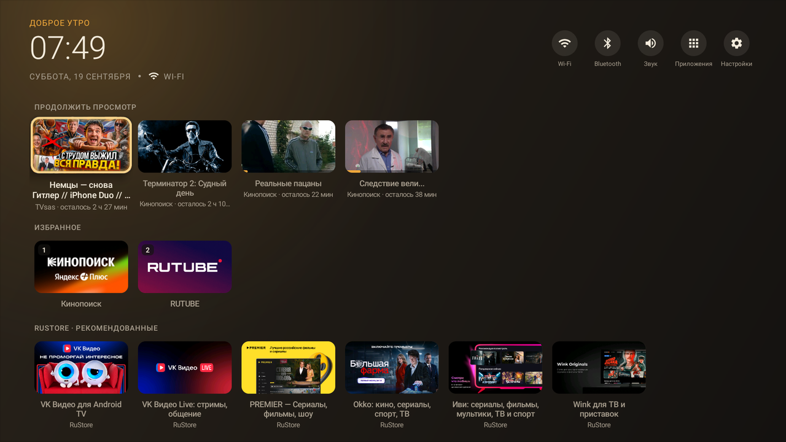
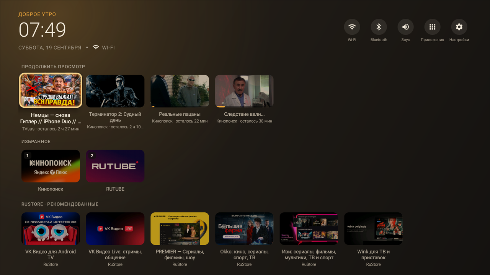
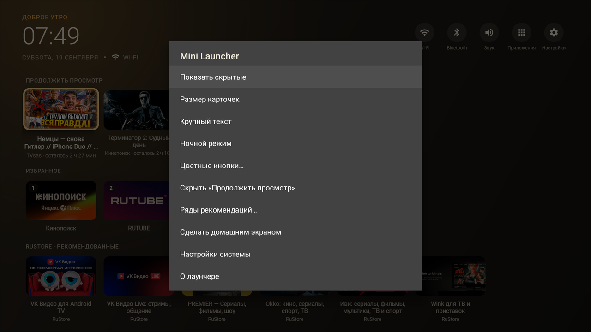
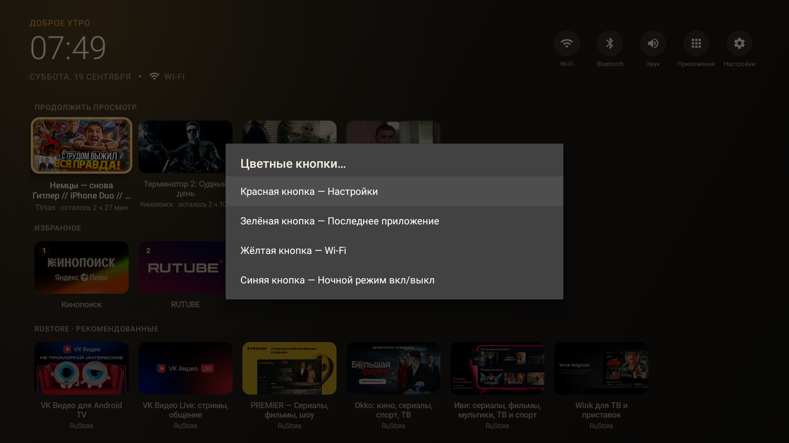

# Mini Launcher for Android TV

Минималистичный домашний экран для старых и слабых Android TV.
APK ~75 КБ, ~12 МБ живой памяти, 0 % CPU в простое.



<table>
  <tr>
    <td></td>
    <td></td>
  </tr>
  <tr>
    <td align="center">Ночной режим: баннеры приглушены, карточка в фокусе — полной яркости</td>
    <td align="center">Меню лаунчера (кнопка MENU)</td>
  </tr>
  <tr>
    <td colspan="2"></td>
  </tr>
  <tr>
    <td colspan="2" align="center">Назначение цветных кнопок пульта</td>
  </tr>
</table>

- Никаких библиотек: ни AndroidX, ни Leanback, ни Kotlin-runtime — только платформенные API.
- Все баннеры приложений один раз рендерятся в маленькие плитки 320×180 RGB_565 в фоновом потоке
  с низким приоритетом и кэшируются на диске — при следующем запуске ничего не декодируется заново.
- Нет фоновых сервисов, таймеров и опросов: всё либо статично, либо реагирует на системные события.
- Работает на Android 5.0 (API 21) и новее; «Продолжить просмотр» — с Android 8.0.

## Возможности

- Верхняя панель: часы, дата, состояние сети (Wi-Fi с уровнем сигнала / Ethernet / нет сети —
  обновляется по broadcast'ам системы, только пока лаунчер на экране).
- Быстрые кнопки: Wi-Fi, Bluetooth, Звук, Приложения, Настройки. Показываются только те,
  которые прошивка реально умеет открыть.
- **Продолжить просмотр** — строка из системной таблицы Watch Next (Кинопоиск, Rutube, YouTube и т. д.)
  с постерами, прогрессом и «осталось N мин». Запрос к ContentProvider при выходе на экран плюс
  `ContentObserver`, пока лаунчер виден (приложения дописывают позицию через несколько секунд после
  выхода из плеера); постеры кэшируются на диске. Нужно разрешение «Читать программу передач» (`READ_TV_LISTINGS`).
- **Ряды рекомендаций** — каналы, которые приложения публикуют в TvProvider («Кинопоиск · Популярное»,
  «RuStore · Рекомендованные»…). Включаются по одному в меню, по умолчанию выключены.
- **Цифры пульта** `1`–`9` запускают избранное по номеру (номер виден на карточке); **цветные кнопки**
  назначаются в меню: последнее приложение, Wi-Fi, Bluetooth, звук, настройки, ночной режим.
- После выхода из плеера фокус встаёт на карточку «Продолжить просмотр» этого приложения.
- Сеть: «Wi-Fi · без интернета», если роутер есть, а интернета нет (флаг VALIDATED от системы).
- **Своя картинка** для плитки любого приложения — с USB-накопителя, через меню карточки.
- Приветствие по времени суток, крупный текст, мягкое появление при запуске.
- **Ночной режим** (авто 20:00–07:00 / вкл / выкл): баннеры приглушаются тёплым фильтром, карточка
  в фокусе остаётся яркой. Час проверяется один раз при выходе на экран, таймеров нет.
- Тёплая палитра без синевы: кремовый текст вместо белого, янтарный акцент — комфортно вечером.
- Сетка приложений с баннерами (16:9), секции «Избранное», «Все приложения», «Скрытые».
- **OK** — открыть, **удержание OK** — меню (избранное, сдвинуть, скрыть, о приложении, удалить),
  **MENU** — меню лаунчера (скрытые, размер карточек, крупный текст, ночной режим, цветные кнопки,
  «Продолжить просмотр», ряды рекомендаций, домашний экран).
- Список обновляется сам при установке/удалении приложений.
- Локализация: русский и английский.

## Сборка

Нужен JDK 17 и Android SDK (compileSdk 36).

```
./gradlew assembleRelease
```

APK: `app/build/outputs/apk/release/app-release.apk` (подписан debug-ключом, ставится через adb).

## Релиз

Сборка и публикация автоматизированы через GitHub Actions:

- **CI** ([.github/workflows/ci.yml](.github/workflows/ci.yml)) — на каждый push/PR собирает APK
  и прикладывает его артефактом (14 дней).
- **Release** ([.github/workflows/release.yml](.github/workflows/release.yml)) — по тегу `v*`
  собирает APK, подписанный релизным ключом, и создаёт GitHub Release с файлом
  `MiniLauncher-X.Y.Z.apk` и списком коммитов с прошлого тега.

Выпустить версию:

```
git tag v1.1.0
git push origin v1.1.0
```

`versionName` берётся из тега, `versionCode` — число коммитов до него (всегда растёт).

### Ключ подписи

Локально ключ лежит в `keystore/release.jks` + `keystore/keystore.properties` (оба в `.gitignore`,
см. [keystore/README.md](keystore/README.md)). Без них `assembleRelease` подписывает debug-ключом.

Для CI добавьте в **Settings → Secrets and variables → Actions** четыре секрета:

| Секрет | Значение |
|---|---|
| `KEYSTORE_BASE64` | `base64 -w0 keystore/release.jks` (PowerShell: `[Convert]::ToBase64String([IO.File]::ReadAllBytes("keystore
elease.jks"))`) |
| `KEYSTORE_PASSWORD` | из `keystore.properties` |
| `KEY_ALIAS` | `minilauncher` |
| `KEY_PASSWORD` | из `keystore.properties` |

Если секретов нет, релиз всё равно соберётся, но с debug-подписью (об этом будет написано в заметках релиза).
Ключ **не теряйте**: APK с другим ключом не встанет поверх установленного без удаления.

## Установка на ТВ

```
adb connect <ip-телевизора>
adb install -r app/build/outputs/apk/release/app-release.apk
```

Затем нажмите **HOME** на пульте и выберите «Mini Launcher» → «Всегда».
Если система не спрашивает, откройте лаунчер из старого домашнего экрана и выберите
«Сделать домашним экраном» в меню.
